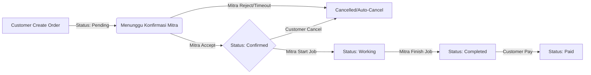

# Posko - Customer Frontend

Aplikasi frontend (Customer App) untuk platform **Posko (Jasa Terdekat)**. Aplikasi ini dibangun menggunakan **Next.js 14** dengan **App Router**, dirancang untuk memberikan pengalaman pengguna yang cepat dan responsif dalam mencari dan memesan jasa profesional.

## 🚀 Teknologi Utama

Project ini dibangun dengan modern web stack:

- **Framework**: [Next.js 14](https://nextjs.org/) (App Router, Server Components)
- **Language**: [TypeScript](https://www.typescriptlang.org/)
- **Styling**: [Tailwind CSS](https://tailwindcss.com/)
- **State Management**: 
  - **Server State**: [TanStack Query (React Query)](https://tanstack.com/query/latest) - Untuk caching, synchronization, dan update data server.
  - **Client State**: React Context (`SocketContext`, `LanguageContext`) untuk state global aplikasi.
- **Maps**: [Leaflet](https://leafletjs.com/) & [React Leaflet](https://react-leaflet.js.org/) - Integrasi peta interaktif.
- **Real-time**: [Socket.io Client](https://socket.io/) - Koneksi WebSocket untuk update pesanan dan chat.
- **HTTP Client**: Axios dengan interceptor untuk manajemen token.

---

## 🏗️ Pola Arsitektur (Architecture Patterns)

Project ini menggunakan pendekatan **Feature-First Architecture** untuk menjaga skalabilitas dan maintainability kode. Kode tidak dikelompokkan berdasarkan *jenis file* (components, hooks, utils), melainkan berdasarkan **FITUR BISNIS**.

### 📂 Struktur Folder Detail (`src/`)

```bash
src/
├── app/                 # Next.js App Router (Routing & Pages)
│   ├── (dashboard)/     # Route group untuk halaman utama
│   ├── (auth)/          # Route group untuk login/register
│   └── layout.tsx       # Root layout (Fonts, Providers, Global CSS)
│
├── components/          # Shared Atomic Components (UI Generik)
│   ├── ui/              # Komponen dasar (Button, Input, Card)
│   └── LocationPicker.tsx # Komponen Peta Global
│
├── features/            # 🧠 UPDATE UTAMA: Modul Fitur Mandiri
│   ├── auth/            # Login, Register, Forgot Password
│   ├── orders/          # Logic Pemesanan (API, Types, Components)
│   ├── services/        # Katalog & Pencarian Jasa
│   ├── providers/       # Profil & Listing Mitra
│   ├── chat/            # Chat Widget & Logic
│   ├── profile/         # Manajemen User Profile
│   └── reviews/         # Ulasan & Rating
│
├── context/             # Global Context Providers (Theme, Socket, Lang)
├── lib/                 # Konfigurasi Library (Axios, Helper)
└── middleware.ts        # Next.js Middleware untuk proteksi route
```

### 🧠 Konsep Penting

1.  **Features (`src/features/*`)**
    Setiap folder fitur (misal `orders`) bersifat mandiri dan biasanya berisi:
    *   `api.ts`: Kumpulan fungsi call API ke backend.
    *   `types.ts`: Interface TypeScript yang dipakai fitur ini.
    *   `components/`: Komponen UI yang hanya dipakai oleh fitur ini (misal `OrderCard`).

2.  **Server State vs Client State**
    *   **Server State (React Query)**: Digunakan untuk data yang disimpan di DB (Orders, Profile, Services). Jangan simpan data ini di Redux/Context manual.
    *   **Client State (Context)**: Digunakan HANYA untuk "App State" seperti posisi scroll, tema gelap/terang, bahasa, atau status koneksi socket.

---

## 🔄 Alur & Proses Bisnis (Flows)

### 1. 📦 Order Lifecycle (Siklus Pesanan)

Pesanan memiliki state machine yang ketat untuk menjamin integritas transaksi.



*   **Create Order**: Customer memilih jasa, mengisi form (lokasi, waktu, foto masalah), checkout.
*   **Incoming Order**: Order masuk ke aplikasi Mitra.
*   **Working**: Mitra check-in di lokasi / mulai pengerjaan.
*   **Dispute**: Jika ada masalah, Customer bisa mengajukan komplain via `/dispute` dengan upload bukti foto.

### 2. 🔐 Autentikasi (JWT Flow)

1.  **Login**: User post email/password -> Server return `accessToken` & `refreshToken`.
2.  **Storage**:
    *   `accessToken`: Disimpan di Memory / LocalStorage (untuk akses UI).
    *   `cookies`: Token juga diset di cookie `httpOnly` agar bisa dibaca oleh **Middleware**.
3.  **Middleware check**:
    *   Setiap akses ke `/orders` atau `/profile`, `src/middleware.ts` mengecek cookie token.
    *   Jika null/expired -> Redirect ke `/login`.

### 3. 📡 Real-time Socket System

Socket otomatis connect saat user login.

**Event Dictionary:**

| Event Name | Arah | Trigger | Action Frontend |
| :--- | :--- | :--- | :--- |
| `connect` | Server->Client | Login Berhasil | Set status indikator "Online" |
| `order_status_update` | Server->Client | Mitra update status | 1. Munculkan Notifikasi<br>2. Auto-refresh list pesanan (`queryClient.invalidate`) |
| `notification:new_message` | Server->Client | Mitra kirim chat | 1. Bunyi notifikasi<br>2. Update badge counter chat |

---

## 🛠️ Setup & Instalasi

### 1. Environment Variables

Buat file `.env.local`:

```env
# URL Backend Utama (Wajib)
NEXT_PUBLIC_API_URL=http://localhost:5000/api

# URL Socket Server (Opsional, deafult ke host API)
NEXT_PUBLIC_SOCKET_URL=http://localhost:4000
```

### 2. Jalankan Project

```bash
npm install
npm run dev
```

## ⚠️ Troubleshooting Guide

**Q: Peta tidak muncul / Marker pecah?**
A: Pastikan CSS Leaflet sudah diimport di `src/app/layout.tsx`.
```tsx
import "leaflet/dist/leaflet.css"; 
// Taruh DI ATAS import globals.css jika bermasalah
```

**Q: Token Expired terus / Logout sendiri?**
A: Cek jam server backend dan jam laptop Anda. JWT sangat sensitif terhadap waktu. Pastikan keduanya sync.
Juga cek `src/lib/axios.ts` untuk melihat logika *Refresh Token Auto-Retry*.

**Q: Error "Window is not defined" di Component?**
A: Karena Next.js SSR. Jika menggunakan `localStorage` atau `Leaflet`, bungkus dalam `useEffect` atau gunakan on component mount check.

## 🚢 Deployment

1.  **Build**: `npm run build`
2.  **Start**: `npm run start`

Disarankan menggunakan Docker container untuk production. Pastikan set `output: 'standalone'` di `next.config.mjs` untuk hasil build yang minimalis.
